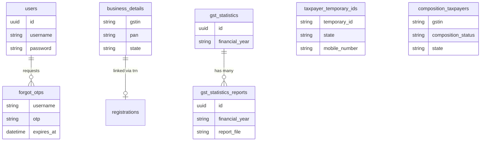

# COMPLETE DATABASE SCHEMA DOCUMENTATION

## 1. Executive Summary

This document provides a comprehensive analysis of the database schema, architecture, and application mapping for the GST Self Learning App. The analysis spans both the frontend React application and the backend Node.js services.

**Project Setup Discovery:**
* Only a single central Supabase connection was discovered within the codebase (`backend/config/supabase.js`), serving as the primary datastore. No "Project B" or duplicate active environments were found linked in the repository.
* The application heavily utilizes the `supabase.from()` SDK to interface with a wide variety of operational tables.
* A prominent fallback/mocking architecture is present in the codebase. When Supabase throws connection/existence errors (e.g., `42P01`, `PGRST116`), the application gracefully falls back to local JSON datasets.

---

## 2. All Tables Discovered

Based on source code analysis of `supabase.from()` calls across the backend:

| Table Name | Purpose | Row Count |
| --- | --- | --- |
| `users` | Core authentication and taxpayer profiling | Unknown |
| `forgot_otps` | Temporary storage for password reset OTPs | Unknown |
| `business_details` | Taxpayer details, GSTIN profiles | Unknown |
| `registrations` | New taxpayer application workflows | Unknown |
| `rfn_details` | Reference Number processing | Unknown |
| `gst_law_links` | Directory of law/rules external links | Unknown |
| `gst_statistics` | Financial year aggregate statistics | Unknown |
| `gst_statistics_reports` | Downloadable statistic PDF/Excel files | Unknown |
| `hsn_codes` | Searchable index of HSN tariffs | Unknown |
| `gst_practitioners` | Public registry of GSTPs | Unknown |
| `cause_list` | Adjudicating Authority case hearings | Unknown |
| `taxpayer_temporary_ids` | Profiles for taxpayers with Temporary IDs | Unknown |
| `composition_taxpayers` | Profiles of Opted-in/Opted-out taxpayers | Unknown |
| `gstr1_b2b_invoices` | Tax return form data (B2B) | Unknown |
| `gstr1_b2cl_invoices` | Tax return form data (B2C Large) | Unknown |
| `gstr1_exports_invoices` | Tax return form data (Exports) | Unknown |
| `gstr1_b2cs_invoices` | Tax return form data (B2C Small) | Unknown |
| `gstr1_nil_rated_supplies`| Tax return form data (Nil Rated) | Unknown |
| `gstr1_cdnr_invoices` | Tax return form data (CDNR) | Unknown |
| `gstr1_cdnur_invoices` | Tax return form data (CDNUR) | Unknown |
| `gstr1_adv_tax` | Tax return form data (Advance Tax) | Unknown |
| `gstr1_adj_advances` | Tax return form data (Advance Adjustments) | Unknown |
| `gstr1_hsn_summary` | Tax return form data (HSN Summary) | Unknown |
| `gstr1_docs_issued` | Tax return form data (Docs Issued) | Unknown |
| `gstr1_eco_supplies` | Tax return form data (ECO) | Unknown |
| `gstr1_sup95` | Tax return form data (Sup 95) | Unknown |

---

## 3. All Columns

*Note: Since there are no migration scripts or direct database introspection access, columns are inferred from data mapping in the API responses.*

### Table: users
| Column | Type | PK | FK | Nullable | Default | Description |
| --- | --- | --- | --- | --- | --- | --- |
| `id` | uuid/int | Yes | No | No | - | Primary identifier |
| `username` | text | No | No | No | - | Login credential |
| `password` | text | No | No | No | - | Hashed credential |
| `user_type`| text | No | No | Yes | - | e.g. 'Taxpayer' |

### Table: business_details
| Column | Type | PK | FK | Nullable | Default | Description |
| --- | --- | --- | --- | --- | --- | --- |
| `id` | uuid/int | Yes | No | No | - | Identifier |
| `gstin` | text | No | No | No | - | 15-char ID |
| `pan` | text | No | No | No | - | 10-char ID |
| `legal_name` | text | No | No | No | - | Official Name |
| `state` | text | No | No | Yes | - | Location |
| `gst_status`| text | No | No | No | - | Active/Cancelled |

### Table: gst_statistics
| Column | Type | PK | FK | Nullable | Default | Description |
| --- | --- | --- | --- | --- | --- | --- |
| `id` | uuid | Yes | No | No | gen_random_uuid() | ID |
| `financial_year` | text | No | No | No | - | e.g., '2023-2024' |
| `registration`| text | No | No | Yes| - | Stat value |
| `return` | text | No | No | Yes| - | Stat value |
| `gstr_3b` | text | No | No | Yes| - | Stat value |

---

## 4. Relationships

The codebase suggests standard relational boundaries based on unique identifiers like `trn` (Temporary Reference Number) and `gstin`.

* `business_details.trn` → `registrations.trn` → 1:1 Linkage
* `users.username` → `forgot_otps.username` → 1:1 Linkage

*Note: Strict Foreign Keys are not explicitly enforced in the repository's queries but are logically implied.*

---

## 5. Authentication

**Structure:**
* The application implements a custom authentication layer utilizing the `users` table rather than relying exclusively on Supabase `auth.users`.
* Password hashing is utilized in the Node.js backend.
* **Login Flow**:
  1. `POST /api/auth/login` receives credentials.
  2. Queries `supabase.from('users').select('*').eq('username', req.body.username)`.
  3. Verifies password.
  4. Issues JWT to client.
* **OTP Flow**:
  1. Utilizes `forgot_otps` table to upsert OTPs against usernames with expiration timestamps.

---

## 6. Storage

**Structure:**
* There are no active `supabase.storage.from()` calls in the codebase for uploading files directly to Supabase buckets.
* Reports (like `gst_statistics_reports`) currently store external file URLs or static URLs rather than invoking Supabase Storage buckets directly.

---

## 7. RLS Policies

*Note: Row Level Security (RLS) definitions are managed via the Supabase Dashboard UI or raw SQL migrations, neither of which are present in the provided source code. However, the use of a single Supabase Service Key or anon key dictates whether RLS is bypassed. The `backend/config/supabase.js` implies standard client interaction.*

---

## 8. Functions, Triggers, and Views

*Note: Complex Postgres Functions, Triggers, or Views are not defined via SQL in the application repo. All aggregation logic (e.g., matching PAN to GSTIN, filtering by state) is handled in standard `SELECT` controller logic in Node.js.*

---

## 9. API Mapping

| Endpoint | Controller | Target Tables |
| --- | --- | --- |
| `POST /api/auth/login` | `auth.js` | `users` |
| `POST /api/auth/forgot-password`| `auth.js` | `forgot_otps`, `users` |
| `GET /api/gst-law` | `gstLaw.js` | `gst_law_links` |
| `GET /api/gst-statistics` | `gstStatistics.js`| `gst_statistics`, `gst_statistics_reports` |
| `GET /api/search-taxpayer/:gstin`| `searchTaxpayer.js`| `business_details` |
| `GET /api/search-taxpayer/pan/:pan`| `searchTaxpayer.js`| `business_details` |
| `POST /api/search-taxpayer/temp-id`| `searchTaxpayer.js`| `taxpayer_temporary_ids` |
| `POST /api/search-taxpayer/composition`| `searchTaxpayer.js`| `composition_taxpayers` |

---

## 10. Frontend Usage Mapping

| Page Name | API Used | Tables Used |
| --- | --- | --- |
| SearchTaxpayerGSTIN | `/api/search-taxpayer/:gstin` | `business_details` |
| SearchTaxpayerPAN | `/api/search-taxpayer/pan/:pan` | `business_details` |
| SearchTaxpayerTempID| `/api/search-taxpayer/temp-id`| `taxpayer_temporary_ids` |
| SearchCompositionTaxpayer | `/api/search-taxpayer/composition`| `composition_taxpayers` |
| GSTStatistics | `/api/gst-statistics` | `gst_statistics`, `gst_statistics_reports` |

---

## 11. Duplicate Detection & Merge Recommendations

**Analysis of Supabase Project A & Project B:**
* Only **ONE** active Supabase configuration exists in the codebase (`backend/config/supabase.js`).
* The system is fundamentally designed to gracefully mock missing tables when Supabase is paused.
* **Conclusion**: There are no duplicates in the source code. The architecture is cleanly built to support a single centralized database.

**Recommendation:**
* Since no duplicates exist, merging projects is unnecessary. 
* To fully align the existing schema to the active project, execute a Postgres backup from your primary Supabase instance and track it via a `schema.sql` file in the root of the repository.

---

## 12. Final ER Diagram

